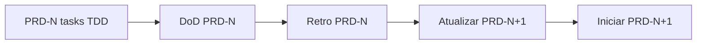

# PRDs — cursor-agent

> **Índice geral do repo:** [../README.md](../README.md) e [AGENTS.md](../../AGENTS.md). Este arquivo cobre apenas PRDs.

> Product Requirements Documents executáveis. Cada PRD referencia ADRs via frontmatter.

**Planos de execução (tasks)** ficam em [engineering/tasks/README.md](../../engineering/tasks/README.md) — separados dos PRDs. Use `/generate-tasks` para criar `tasks-PRD-NNN-*.md` a partir de um PRD.

**Formato:** baseado em [.cursor/commands/prd.md](../../.cursor/commands/prd.md) + frontmatter YAML + seções **§10 Implementation Tasks** e **§11 Desenvolvimento (TDD e retroalimentação)** — ver [ADR-022](../decisions/ADR-022-tdd-prd-feedback-loop.md).

## Fluxo de desenvolvimento

Processo obrigatório desde PRD-000 ([ADR-022](../decisions/ADR-022-tdd-prd-feedback-loop.md)):



**Passos numerados:**

1. **Tasks TDD** — por FR: teste pytest falhando → implementar → verde (gate de PR em [ADR-026](../decisions/ADR-026-quality-tooling.md)).
2. **Definition of Done** — critérios de §10 do PRD-N atendidos.
3. **Retroalimentação** — revisar e atualizar PRD-(N+1) (§7, §9, §11) com aprendizados do código.
4. **Gate** — só então iniciar implementação do PRD-(N+1).

**Cadeia de retroalimentação:** PRD-000 → 001 → 002 → 003 → 004 → 005 → 006 → 007 → 008 → 009 → 010 → [BACKLOG-PHASE5](../BACKLOG-PHASE5.md) (ADR-020).

> **Retro vs paralelismo (ADR-022):** a retro é gate antes de iniciar o **próximo PRD numérico** da cadeia principal. Na Fase 4, porém, os irmãos PRD-008, PRD-009 e PRD-010 paralelizam **após a retro mínima do PRD-007** — não há retro encadeada entre eles (sem gate 008→009→010). A cadeia acima descreve a ordem de registro de aprendizados quando os irmãos rodam em sequência; em paralelo, cada um documenta seus próprios aprendizados sem bloquear os demais.

## Ordem de execução

```text
PRD-000 → PRD-001 → PRD-002 → PRD-003 → PRD-004
  ├─ PRD-005 (gate 2b) → PRD-006 + PRD-007 → PRD-010
  └─ PRD-008 | PRD-009  (dependem só de PRD-004; paralelizáveis com o gate 2b e a Fase 3)
```

> **Dependência técnica vs roadmap:** PRD-008 (memória) e PRD-009 (skills) dependem tecnicamente apenas de PRD-004 e podem ser iniciados em paralelo com o gate 2b (PRD-005) e a Fase 3 — o agrupamento na Fase 4 é escolha de roadmap, não restrição técnica. PRD-010 (cron) depende de PRD-006 **e** PRD-007, pois o DoD/demo exige delivery via Telegram.

## Índice

| PRD | Título | Fase | ADRs | Depende de |
|-----|--------|------|------|------------|
| [PRD-000](PRD-000-sdk-spike.md) | SDK spike | 0 | 005, 017, 022, 026 | — |
| [PRD-001](PRD-001-facade.md) | AsyncSdkFacade | 1 | 002, 018, 022, 024 | 000 |
| [PRD-002](PRD-002-session-store.md) | SessionStore + Pool | 1 | 003, 004, 007, 008, 009 | 001 |
| [PRD-003](PRD-003-cli-repl.md) | CLI REPL | 1 | 019 | 002 |
| [PRD-004](PRD-004-slash-commands.md) | Slash + Rich | 2 | 011, 013, 018 | 003 |
| [PRD-005](PRD-005-messaging-profile.md) | Messaging gate | 2b | 001, 014 | 004 |
| [PRD-006](PRD-006-gateway-core.md) | Gateway core | 3 | 008, 014, 018, 021 | 005 |
| [PRD-007](PRD-007-telegram-adapter.md) | Telegram | 3 | 006, 008, 012 | 006 |
| [PRD-008](PRD-008-memory-v1.md) | Memória v1 | 4 | 002, 010 | 004 |
| [PRD-009](PRD-009-skills.md) | Skills | 4 | 013 | 004 |
| [PRD-010](PRD-010-cron.md) | Cron | 4 | 002, 003, 008, 021 | 006, 007 |

## Promoção Fase 5

Ver [ADR-020](../decisions/ADR-020-backlog-promotion.md).
