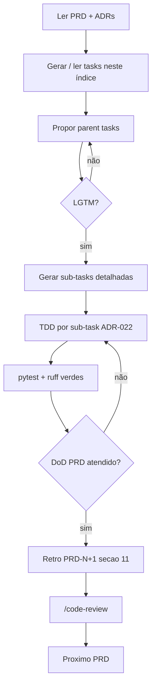

# Planos de tarefas — cursor-agent

> **Índice geral do repo:** [AGENTS.md](../../AGENTS.md). **PRDs** (requisitos) ficam em [docs/prd/](../../docs/prd/); **tasks** (execução) ficam aqui.

## Propósito

Este diretório concentra **todos os planos de tarefas** derivados dos PRDs. Cada arquivo `tasks-PRD-XXX-*.md` quebra um PRD em parent tasks e sub-tasks executáveis por agentes de IA ou desenvolvedores, com critérios de aceite, comandos **Verify** (TDD) e dependências explícitas.

Os PRDs definem *o quê* e *por quê*; as tasks definem *como* implementar passo a passo.

## Convenção de nomes

```text
tasks-PRD-{NNN}-{slug}.md
```

| Parte | Exemplo | Descrição |
|-------|---------|-----------|
| `NNN` | `000` | Número do PRD, três dígitos |
| `slug` | `sdk-spike` | Slug do arquivo PRD (sem prefixo `PRD-`) |

**Exemplo:** [tasks-PRD-000-sdk-spike.md](tasks-PRD-000-sdk-spike.md) ← [PRD-000-sdk-spike.md](../../docs/prd/PRD-000-sdk-spike.md).

## Como gerar tasks

1. Escolha o PRD ativo em [docs/prd/README.md](../../docs/prd/README.md).
2. No Cursor, use o comando **`/generate-tasks`** (especificação em [.cursor/commands/generate-tasks.md](../../.cursor/commands/generate-tasks.md)).
3. **Fase 1:** o agente propõe parent tasks e **pausa** aguardando **LGTM** do usuário.
4. **Fase 2:** após LGTM, gera sub-tasks detalhadas (formato com **File**, **What**, **Why**, **Verify**) e salva neste diretório.
5. Atualize a tabela de índice abaixo ao criar um novo arquivo.

## Índice de planos

| Arquivo de tasks | PRD | Fase | Status |
|------------------|-----|------|--------|
| [tasks-PRD-000-sdk-spike.md](tasks-PRD-000-sdk-spike.md) | [PRD-000](../../docs/prd/PRD-000-sdk-spike.md) | 0 | Fase 2 completa |
| `tasks-PRD-001-facade.md` | [PRD-001](../../docs/prd/PRD-001-facade.md) | 1 | pendente |
| `tasks-PRD-002-session-store.md` | [PRD-002](../../docs/prd/PRD-002-session-store.md) | 1 | pendente |
| `tasks-PRD-003-cli-repl.md` | [PRD-003](../../docs/prd/PRD-003-cli-repl.md) | 1 | pendente |
| `tasks-PRD-004-slash-commands.md` | [PRD-004](../../docs/prd/PRD-004-slash-commands.md) | 2 | pendente |
| `tasks-PRD-005-messaging-profile.md` | [PRD-005](../../docs/prd/PRD-005-messaging-profile.md) | 2b | pendente |
| `tasks-PRD-006-gateway-core.md` | [PRD-006](../../docs/prd/PRD-006-gateway-core.md) | 3 | pendente |
| `tasks-PRD-007-telegram-adapter.md` | [PRD-007](../../docs/prd/PRD-007-telegram-adapter.md) | 3 | pendente |
| `tasks-PRD-008-memory-v1.md` | [PRD-008](../../docs/prd/PRD-008-memory-v1.md) | 4 | pendente |
| `tasks-PRD-009-skills.md` | [PRD-009](../../docs/prd/PRD-009-skills.md) | 4 | pendente |
| `tasks-PRD-010-cron.md` | [PRD-010](../../docs/prd/PRD-010-cron.md) | 4 | pendente |

**Status:** *Fase 1* = parent tasks geradas; *Fase 2 completa* = sub-tasks detalhadas prontas para implementação; *pendente* = arquivo ainda não criado.

## Fluxo para agentes de longa duração

Alinhado ao modelo [Cursor long-running agents](https://cursor.com/blog/long-running-agents) e [ADR-023](../../docs/decisions/ADR-023-long-running-agent-harness.md):



## Checklist por sessão de PRD

Use este checklist em **cada** sessão de agente de longa duração:

1. **Contexto** — Ler [AGENTS.md](../../AGENTS.md), PRD ativo, ADRs do frontmatter e [ADR-022](../../docs/decisions/ADR-022-tdd-prd-feedback-loop.md).
2. **Tasks** — Ler ou criar o arquivo de tasks correspondente neste diretório; confirmar status na tabela acima.
3. **Planejamento** — Propor plano (parent tasks ou próximas sub-tasks) e **aguardar LGTM** antes de codar ([ADR-023](../../docs/decisions/ADR-023-long-running-agent-harness.md)).
4. **TDD** — Por sub-task: teste falhando → implementar → verde ([ADR-022](../../docs/decisions/ADR-022-tdd-prd-feedback-loop.md)).
5. **Qualidade** — gate canônico [ADR-026](../../docs/decisions/ADR-026-quality-tooling.md) antes de marcar sub-task como `[x]`.
6. **Retro** — Ao fechar o PRD, atualizar §7, §9 e §11 do PRD seguinte antes de iniciá-lo.
7. **Code review** — Executar **`/code-review`** ([.cursor/commands/code-review.md](../../.cursor/commands/code-review.md)) com gates em [.cursor/rules/code-review.mdc](../../.cursor/rules/code-review.mdc); veredito **Aprovado** ou **Aprovado com ressalvas** antes de considerar o PRD encerrado.

## Prontidão para desenvolvimento autônomo

**Score atual: Partial** — documentação e processo maduros; scaffold de código e CI ainda ausentes.

### O que já está pronto

| Área | Evidência |
|------|-----------|
| Estratégia e roadmap | [STRATEGY.md](../../docs/STRATEGY.md) — fases 0–4 |
| PRDs executáveis | PRD-000 … PRD-010 com §10/§11 TDD |
| ADRs | ADR-001 … ADR-026 (26 decisões) |
| Ponto de entrada para agentes | [AGENTS.md](../../AGENTS.md) |
| Tasks PRD-000 | Sub-tasks detalhadas (Fase 2 completa) |
| Processo TDD + retro | [ADR-022](../../docs/decisions/ADR-022-tdd-prd-feedback-loop.md) |
| Comandos Cursor | `prd`, `generate-tasks`, `development`, `/code-review` |
| Regras de código | `agent-clean-code.mdc`, `python-best-practices.mdc`, `code-review.mdc` |
| Contratos técnicos | [async-sdk-facade.md](../../docs/contracts/async-sdk-facade.md) |
| Env documentado | `.env.example` |

### Lacunas (principais)

| # | Lacuna | Impacto | Recomendação |
|---|--------|---------|--------------|
| 1 | Sem `pyproject.toml`, `src/`, `tests/` | Agente não consegue rodar pytest/ruff localmente | Implementar PRD-000 task 1.0 (primeiro passo do spike) |
| 2 | Sem CI (`.github/workflows/`) | Sem gate automático em PR | Workflow conforme [ADR-026](../../docs/decisions/ADR-026-quality-tooling.md) (task PRD-000 1.8) |
| 3 | Sem template de PR | Reviews inconsistentes para agentes | Adicionar `.github/pull_request_template.md` com checklist DoD + retro |
| 4 | Código de aplicação inexistente | Repo ainda em planejamento (Fase 0) | Executar tasks PRD-000 em ordem após LGTM do plano de implementação |

> O template de tasks já existe em [engineering/templates/task-template.md](../templates/task-template.md); `generate-tasks.md` referencia um arquivo presente.

### Outras melhorias sugeridas

- **Dependabot** — configurar após `pyproject.toml` ([ADR-017](../../docs/decisions/ADR-017-sdk-version-pin.md)).
- **`Makefile` ou `justfile`** — comando único documentado (`make test`, `make lint`) para agentes.
- **Nightly integration** — workflow com `CURSOR_API_KEY` secret ([ADR-005](../../docs/decisions/ADR-005-testing-strategy.md)).
- **Atualizar índice** — ao gerar cada `tasks-PRD-NNN-*.md`, marcar status na tabela acima.

## Referências

- [Cursor — Long-running agents](https://cursor.com/blog/long-running-agents) — planejamento antes de execução, checkpoints, follow-through.
- [ADR-023 — Long-running agent harness](../../docs/decisions/ADR-023-long-running-agent-harness.md)
- [ADR-022 — TDD e retro entre PRDs](../../docs/decisions/ADR-022-tdd-prd-feedback-loop.md)
- [docs/prd/README.md](../../docs/prd/README.md) — cadeia de PRDs (requisitos)
- [.cursor/commands/generate-tasks.md](../../.cursor/commands/generate-tasks.md) — geração de tasks
- [.cursor/commands/development.md](../../.cursor/commands/development.md) — execução e marcação de progresso
- [.cursor/commands/code-review.md](../../.cursor/commands/code-review.md) — protocolo `/code-review` antes de fechar PRD
- [.cursor/rules/code-review.mdc](../../.cursor/rules/code-review.mdc) — gates obrigatórios de review
